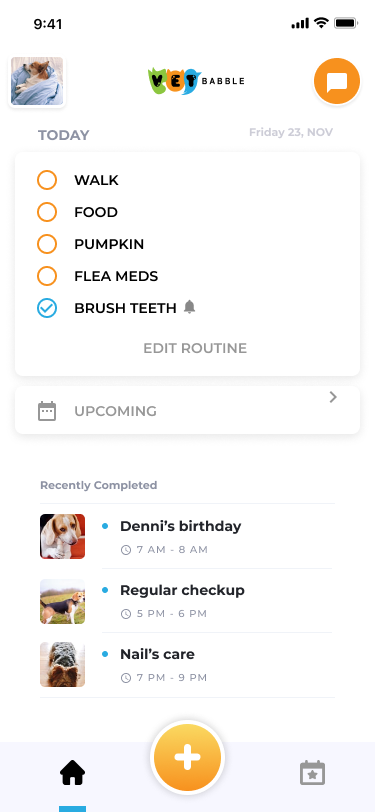

# VetBabble Coding Project

## Overview

Create a ToDo Flutter app for Android or iOS based on the following mockup:

The work you create here should be representative of code that we'd expect to receive from you if you were hired tomorrow. Our expectation is that you'll write production quality code including tests.

While not required, we encourage you to to add a README (or update the existing one) to help us understand your approach work and thought process...design choices, trade-offs, dependencies, etc.

### When you're done with the project...

When you're done with the project, push your work back into the repo. Then, reply to the message you received letting us know you've pushed your project.

## Requirements

- the user should be able to add and complete tasks
- use stateless widgets as much as possible

Please do not include login, registration, or any form of authorization. Your page should work entirely offline.

## Bonus - implement Routines

In our app, tasks are generated by Routines. Routines are typically re-occurring (daily, monthly, M-F, etc.). They can also be a one-off task scheduled in advance (Go to park on Saturday, September 3rd 2020).
